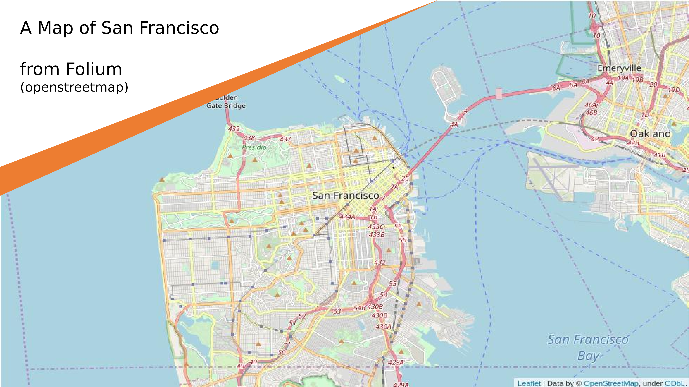
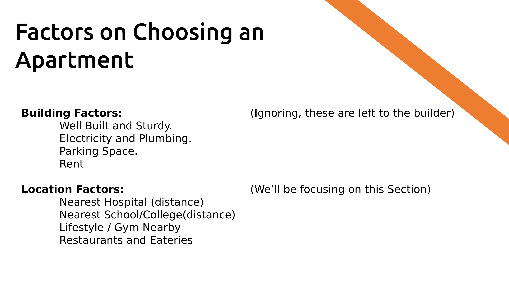
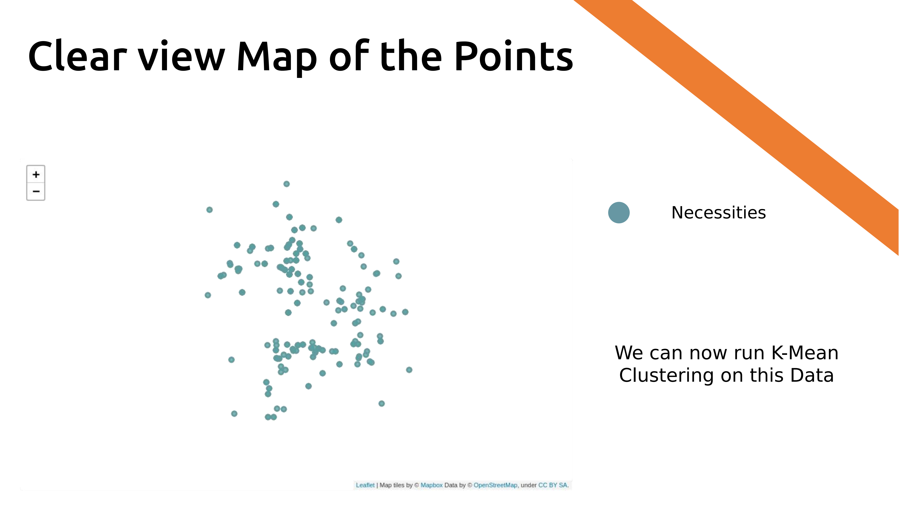
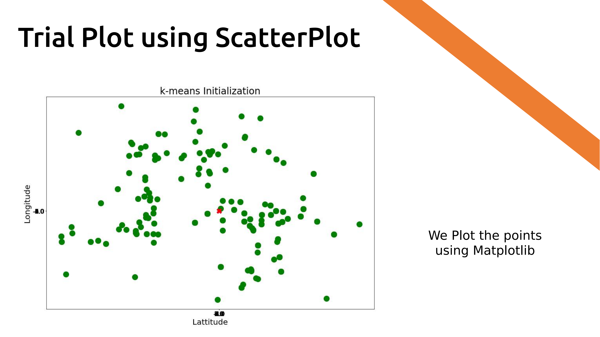
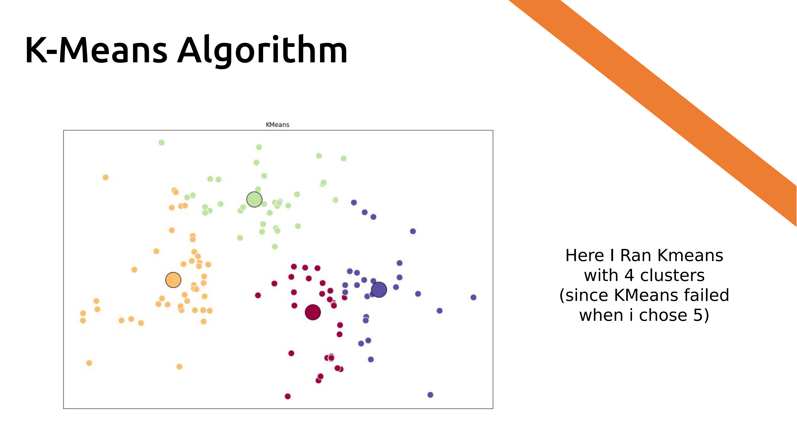

# Coursera_Capstone Project
### Machine Learning Capstone - IBM Data Science

The Project aims to Help choose the best Location to begin an
Apartments Project. Below are some of the Problems we need to answer;
* Where is the best spot to start an Apartments Project ?
* What are the factors on which customers choose Apartments?
* What are the proximities of the basic Necessities available?

Using Foursquare API as a reliable source of Location Data of the City,San Francisco.
We aim to make a suitable Scatter Plot of the Nearby Facilities and hence choose an
appropriate location for Building the Apartment.

## A General Overview of the process

#### Update

A few flaws were seen in the implementation of the project.
The Repo is now just to log the Project details.
